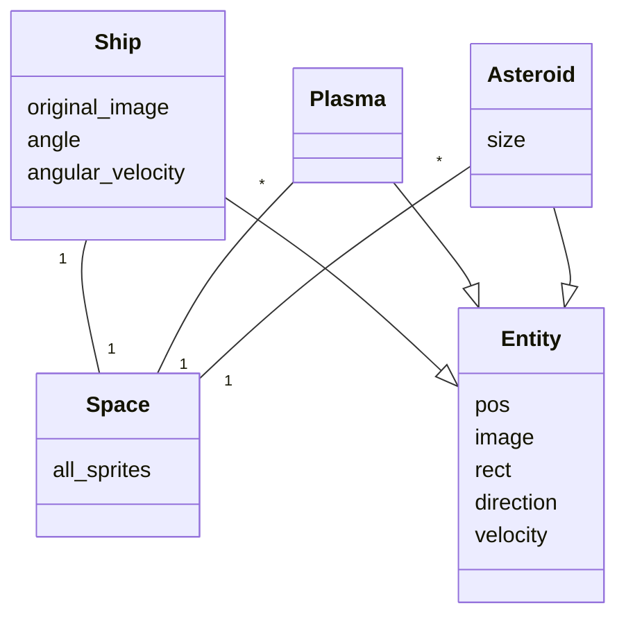

# Arkkitehtuurikuvaus

## Rakenne
Koodin rakenne on jakautunut hakemistotasolla seuraavasti: services-kansio sisältää pääasiallisesta sovelluslogiikasta vastaavat luokat, entities sisältää luokat objekteille joita pelilogiikka käsittelee, ja ui-kansio sisältää käyttöliittymän käsittelyyn liittyvät luokat.

## Käyttöliittymä
Käyttöliittymä koostuu tällä hetkellä kahdesta pääasiallisesta näkymästä, aloitusnäyttönäkymästä ja pelinäkymästä. Aloitusnäkymä ja pelinäkymä on toteutettu EventHandler- ja Renderer-luokkien näille näkymille eriytetyillä metodeilla. Pelinäkymän logiikalle on oma luokkansa, GameLoop, jota UI-luokka ainoastaan kutsuu, mutta toistaiseksi aloitusnäkymän logiikka sisältyy UI-luokkaan.

## Sovelluslogiikka
Pelilogiikka koostuu Space objektin sisältämien Ship-, Plasma-, ja Asteroid-entiteettien välisestä vuorovaikutuksesta. Luokkasuhteet on kuvattu alta löytyvässä kaaviossa.

Pelin korkeamman tason toiminnallisuus on toteutettu enimmäkseen luokan GameLoop kautta. GameLoop pyörittää pelisilmukkaa, kutsuen silmukan jokaisella kierroksella ui-kansion objektien metodeja hakeakseen käyttäjän syötteitä ja piirtääkseen pelinäkymän näytölle, ja näiden välissä kutsuu sille syötetyn Space-objektin metodeja päivittääkseen pelitilaa syötteiden mukaisesti. 
