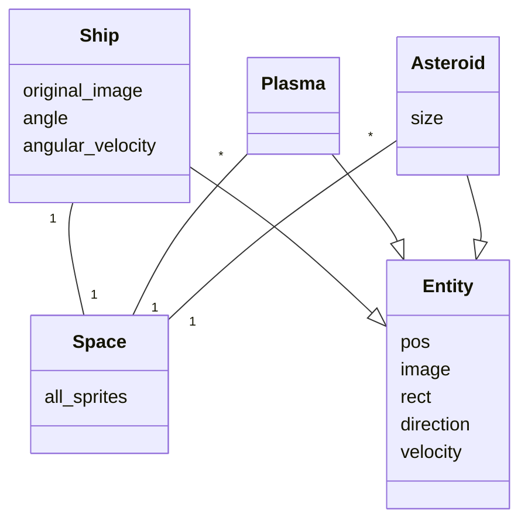
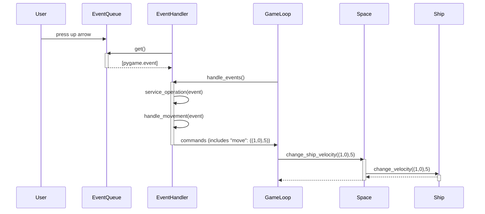
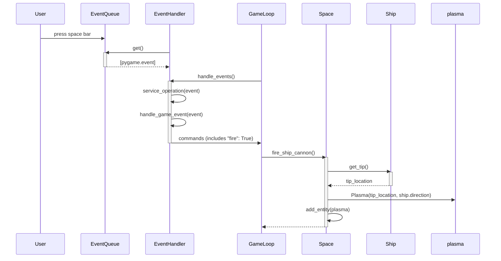
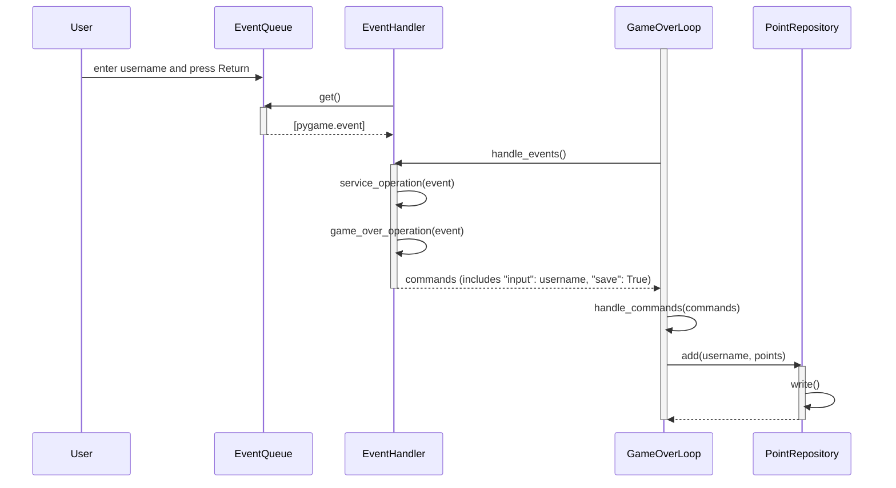

# Arkkitehtuurikuvaus

## Rakenne
Koodin rakenne on jakautunut hakemistotasolla seuraavasti: services-kansio sisältää pääasiallisesta sovelluslogiikasta vastaavat luokat, entities sisältää luokat objekteille joita pelilogiikka käsittelee, ja ui-kansio sisältää käyttöliittymän käsittelyyn liittyvät luokat.

## Käyttöliittymä
Käyttöliittymä koostuu tällä hetkellä kolmesta pääasiallisesta näkymästä, aloitusnäyttönäkymästä, pelinäkymästä ja lopetusnäkymästä. Näkymät on toteutettu EventHandler- ja Renderer-luokkien näille eriytetyillä metodeilla. Kunkin näkymän logiikalle on oma silmukkaluokkansa, joka perii Loop-luokan, ja UI-luokka ainoastaan kutsuu näiden silmukoiden aloitusmetodeita aiemman silmukan palautusarvon perusteella.

## Sovelluslogiikka
Pelilogiikka koostuu Space objektin sisältämien Ship-, Plasma-, ja Asteroid-entiteettien välisestä vuorovaikutuksesta. Luokkasuhteet on kuvattu alta löytyvässä kaaviossa.

Pelin korkeamman tason toiminnallisuus on toteutettu enimmäkseen luokan GameLoop kautta. GameLoop pyörittää pelisilmukkaa, kutsuen silmukan jokaisella kierroksella ui-kansion objektien metodeja hakeakseen käyttäjän syötteitä ja piirtääkseen pelinäkymän näytölle, ja näiden välissä kutsuu sille syötetyn Space-objektin metodeja päivittääkseen pelitilaa syötteiden mukaisesti. 

## Päätoiminnallisuudet

Seuraavassa pelin päätoiminnallisuuksia on kuvattu sekvenssikaavioin.

### Aluksen liikuttaminen eteenpäin

Alusta liikutetaan eteenpäin ylösnuolella. Alus liikkuu eteenpäin niin kauan kuin näppäin on painettu alas.

Gameloop kutsuu toistuvasti EventHandleriä saadakseen uusia käskyjä, ja EventHandler saa EventQueuen tallentaman napinpainalluksen käsiteltäväksi. Se muuntaa tämän käskyksi muuttaa aluksen nopeutta, jonka se välittää GameLoopille. GameLoop kutsuu Spac-luokan change_ship_velocity-metodia jolla aluksen nopeutta muutetaan, joka taas kutsuu Ship-luokan vastaavaa metodia. 

## Plasman ampuminen

Plasman ampuminen onnistuu välilyöntinäppäimellä. Toisin kuin liikkuessa, näppäimen pitäminen painettuna ei johda tapahtuman toistumiseen. 

Tapahtumaketjun alku on lähes identtinen aiempaan verrattuna. Ero tulee EventHandlerin lähettämässä käskyssä, joka tällä kertaa sisältää arvon True avaimelle "fire". Nyt GameLoop kutsuu taas Space-luokan metodia fire_ship_cannon, joka luo uuden Plasma-olion Ship-olion palauttamaan kärjen paikkaan, ja tallentaa tämän avaruuden entiteettien joukkoon.  

## Pisteiden tallentaminen

Perustoiminnallisuus pisteiden tallennuksessa käyttöliittymän osalta on sama kuin aiemmin kuvatuissa tapauksissa. Tällä kertaa sovelluslogiikkaa pyörittää GameOverLoop, joka saa EventQueuen ja EventHandlerin välittämänä käskyn ensin ottaa vastaan käyttäjän syöttämän nimen, ja sitten tallentaa tämän ja käyttäjän pelistä saaman pistemäärän. GameOverLoop kutsuu PointRepositoryn add-metodia lisätäkseen käyttäjän tiedot, joka taas kutsuu omaa write-metodiaan tallentaakseen päivitetyn pistetilanteen pysyväistallennukseen.
