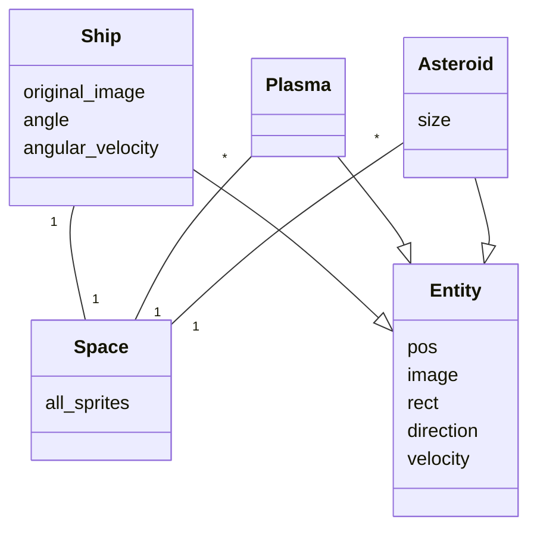

```mermaid
 classDiagram
      Ship "1" -- "1" Space
      Plasma "*" -- "1" Space
      Asteroid "*" -- "1" Space
      Ship --|> Entity
      Plasma --|> Entity
      Asteroid --|> Entity
      class Entity{
          pos
          image
          rect
          direction
          velocity
      }
      class Ship{
          original_image
          angle
          angular_velocity
      }
      class Plasma{
      }
      class Space{
          all_sprites
      }
      class Asteroid{
          size
      }
```
