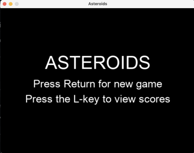

# Käyttöohje

## Käynnistäminen
Ennen ensimmäistä käyttökertaa, aja komentoriviltä:

```bash 
poetry install
```

ja

```bash
poetry run invoke build
```

Tämä asentaa vaadittavat riippuvuudet ja alustaa pistetilastointitiedoston.

Käynnistäminen onnistuu tämän jälkeen komennolla

```bash
poetry run invoke start
```

## Pelin aloittaminen

Ohjelman aloitusnäkymä on seuraava:



Ohjeistuksen mukaisesti käyttäjä voi tästä Enter-näppäintä painamalla aloittaa uuden pelin, tai L-näppäintä painamalla siirtyä tarkastelemaan pistelistoja. Aloitusnäkymään pääsee aina palaamaan painamalla vasenta control-näppäintä. Painamalla Enteriä näkymäksi tulee tämä:


## Pelaaminen

Alusta liikutetaan nuolinäppäimillä, ylänuolella eteen, alanuolella taakse, ja vasemmalla ja oikealla nuolinäppäimellä alusta saa käännettyä. Pelinäkymään ilmestyy asteroideja, joita pelaajan tulisi yrittää aluksella tuhota. Tämä onnistuu painamalla välilyöntinäppäintä, mikä laukaisee plasma-ammuksia. 


Peli päättyy aluksen törmätessä asteroidiin. 

## Pisteiden tallentaminen

Pelin päättyessä näkymä on seuraavanlainen:


Käyttäjä voi syöttää näppäimistöllä käyttäjänimensä, ja tallentaa pistetuloksen tällä nimellä painamalla Enteriä.

## Pistelistojen tarkastelu

Painamalla aloitusnäkymässä L-näppäintä pääsee pistelistaus-näkymään, joka näyttää seuraavanlaiselta:


Oletusarvoisesti näytetään kaikkien aikojen 10 parasta pistetulosta. Vaihtoehtoisesti voi katsella viimeisen viikon parhaita tuloksia painamalla W-näppäintä, tai viimeisen 30-päivän tuloksia painamalla M-näppäintä.
