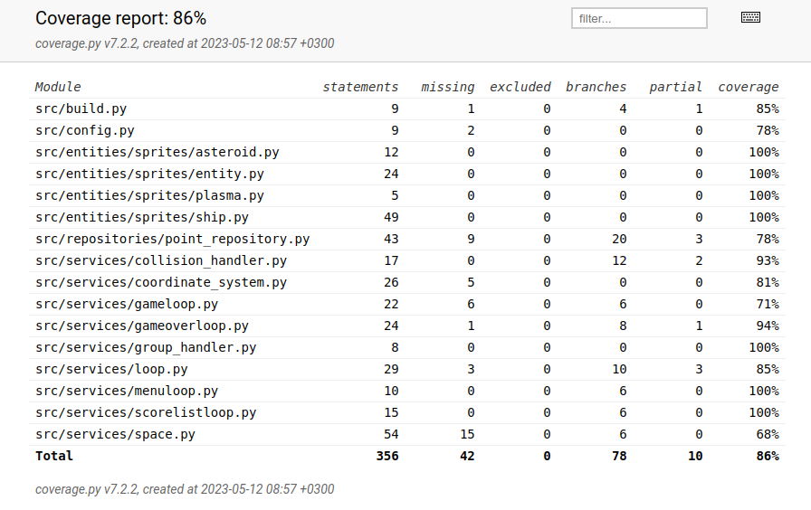

# Testausdokumentti

## Yksikkötestaus

### Sovelluslogiikka

Sovelluslogiikka on jaoteltu useamman luokan välille:
- Loop
- GameLoop
- MenuLoop
- GameOverLoop
- ScoreListLoop
- Space
- Ship
- GroupHandler
- CollisionHandler
- CoordinateSystem

Näille kullekin on tehty omat yksikkötestinsä omilla testausluokillaan (luokalle `Luokka`nimellä `TestLuokka`) luokkakohtaisen toiminnallisuuden testaamiseksi. Loop-luokalle ja sen periville luokille on tehty Stub-luokat Renderer-, EventHandler- ja Clock-luokille jotta luokkia saa testattua irrallaan käyttöliittymästä, ja GroupHandlerille StubGroup abstrahoimaan testit soveltumaan yleisemmille ryhmäolioille, eikä erityisesti pygamen sprite.Groupeille.

### Repositoriot

Sovelluksessa on yksi repositorio, PointRepository, johon tallennetaan ja josta luetaan pelaajien pistetuloksia. Tätä on testattu TestPointRepository-luokassa, jossa käydään läpi yleisimmät perustoiminnallisuudelta vaadittavat tilanteet, ja joka käyttää hyväkseen omaa testitiedostoaan `test-points.csv`.  

### Testauskattavuus

Haarautumakattavuudeksi testeille saatiin 86%

Testauksen ulkopuolelle jäivät käyttöliittymästä vastaavat luokat. Testauksessa on puutteita erityisesti ongelmallisten syötteiden käsittelyn tarkistamisessa.

## Integraatiotestaus

Korkeamman tason luokkien, kuten Loop-tyypin-, ja Space-luokkien testit sisältävät useamman luokan yhteentoimivuuden testaamista. Näissä oli joskus kuitenkin tarpeen määritellä erillisiä testeihin käytettäviä paikanpitäjiä (esim StubRenderer tai FakeSpace) yksittäisen luokan toiminnallisuuden testauksen yksinkertaistamiseksi.

## Järjestelmätestaus

Järjestelmätason toiminnallisuutta on testattu perusteellisesti kehittäjän toimesta. Virheilmoituksia tai perustavanlaatuisia vikoja ei ole ilmennyt niitä etsiessäkään. 

### Asennus

Asennus ja käyttö on testattu macOS- ja Linux-koneilla. 

### Toiminnallisuus

Suurin osa vaatimusmäärittelyssä mainitusta toiminnallisuudesta on testattu sekä automaattisin unittestein että manuaalisesti. Ainoastaan pistelistanäkymän aikajänteen vaihtaminen jäi kokonaan testaamatta.
