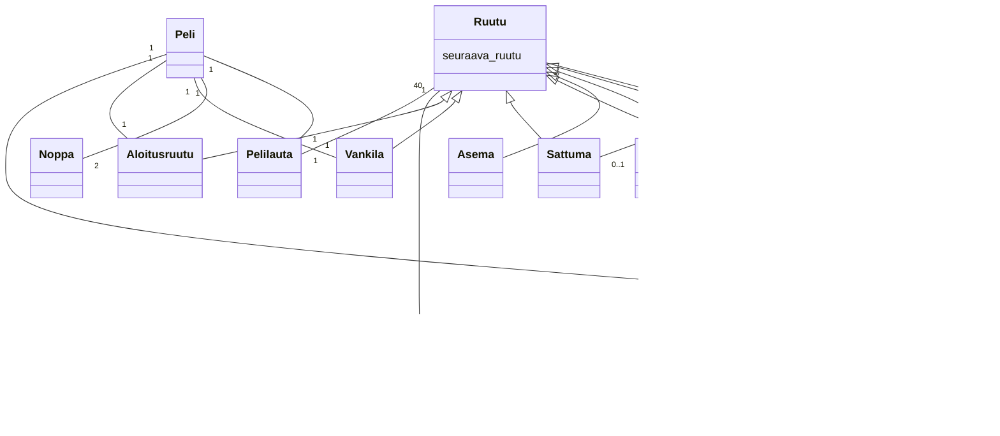

## Laajennettu luokkakaavio monopolille

```mermaid

  classDiagram
  
        Peli "1" -- "2..8" Pelaaja
        
        Peli "1" -- "1" Aloitusruutu
        
        Peli "1" -- "1" Vankila
        
        Peli "1" -- "2" Noppa
        
        Peli "1" -- "1" Pelilauta
        
        Ruutu "40" -- "1" Pelilauta
        
        Ruutu "1" -- "*" Pelinappula
        
        Ruutu <|-- Aloitusruutu
        
        Ruutu <|-- Vankila
        
        Ruutu <|-- Sattuma
        
        Ruutu <|-- Yhteismaa
        
        Ruutu <|-- Asema
        
        Ruutu <|-- Laitos
        
        Ruutu <|-- Katu
        
        Kortti "*" -- "0..1" Sattuma
        
        Kortti "*" -- "0..1" Yhteismaa
        
        Kortti "*" -- "1" Toiminto
        
        Ruutu "*" -- "1" Toiminto
        
        Katu "0..1" -- "0..4" Talo
        
        Katu "0..1" -- "0..1" Hotelli
        
        Katu "*" -- "1" Pelaaja
        
        Pelaaja "1" -- "1" Pelinappula
        
        class Peli{
        
        }
        class Pelaaja{
        
            raha
            
        }
        class Pelilauta{
        
        }
        class Ruutu{
        
            seuraava_ruutu
            
        }
        class Pelinappula{
        
        }
        class Noppa{
        
        }
        
        class Aloitusruutu{
        
        }
        
        class Vankila{
        
        }
        
        class Sattuma{
        
        }
        
        class Yhteismaa{
        
        }
        
        class Asema{
        
        }
        
        class Laitos{
        
        }
        
        class Katu{
        
            nimi
            
        }
        
        class Kortti{
        
        }
        
        class Talo{
        
        }
        
        class Hotelli{
        
        }
        
        class Toiminto{
        
        }
        
        
```
